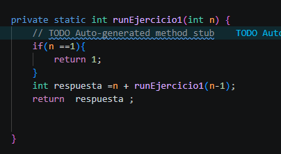
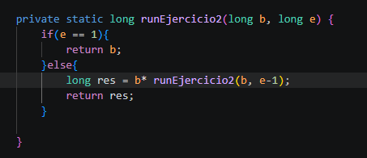
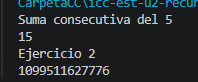

# Práctica: Recursividad

## Datos del Estudiante
- **Nombre:**  Cristopher Carangui
- **Curso:** Estructura de Datos

---

**Fecha:** 15/06/2026
## Descripción:
Suma de enteros consecutivos
## Ejercicio 1

## Descripción:
Pontencia con una base y un exponente
## Ejercicio 2 

## Salida en consola
